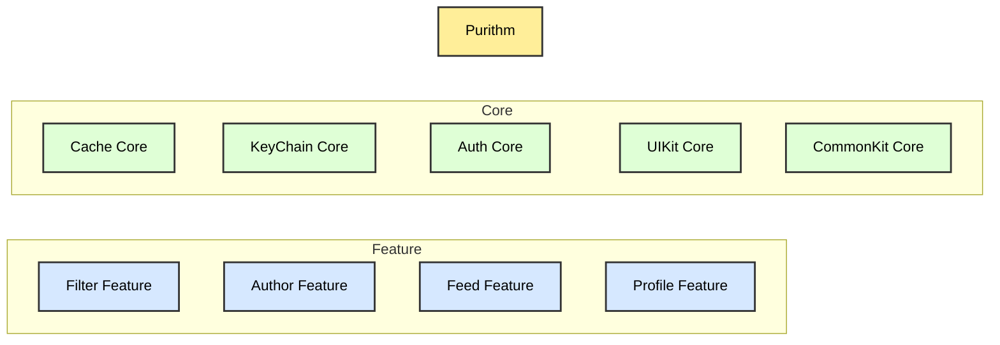
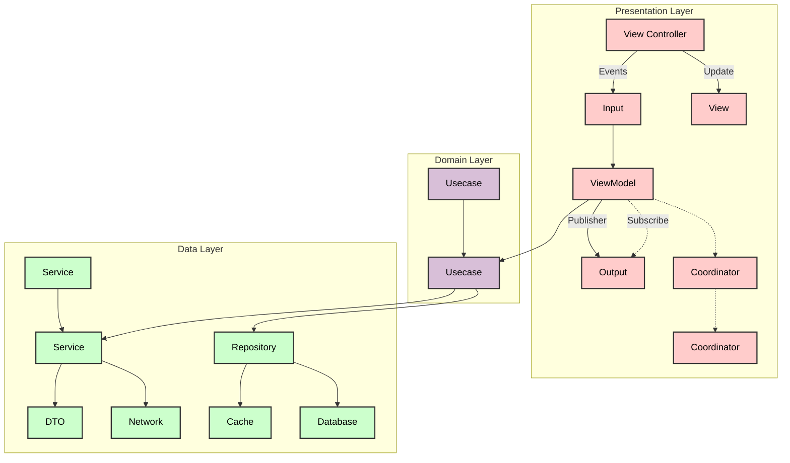

# Purithm - 감성 필터 공유 서비스
앱스토어 링크 ( 현재 서버 일부 내려간 상태입니다. )
 

https://apps.apple.com/kr/app/%ED%93%A8%EB%A6%AC%EC%A6%98/id6523427087

  
  
  
  
  
  

---

## 목차

1. [Module Structure](#-1-module-structure)
   - [Core Modules](#core-modules)
   - [CoreUIKit](#coreuikit)
   - [CommonKit](#commonkit)
   - [Feature Modules](#feature-modules)
2. [Clean Architecture & MVVM-C](#-2-clean-architecture--mvvm-c)
   - [Presentation Layer](#🌟-presentation-layer)
   - [Domain Layer](#🌟-domain-layer)
   - [Data Layer](#🌟-data-layer)
3. [프로젝트에서의 기술적인 도전](#🌟-3-프로젝트에서의-기술적인-도전)
   - [Collection Adapter (with Compositional Layout + Diffable DataSource)](#collection-adapter-with-compositional-layout--diffable-datasource)
   - [요구사항](#🪀-요구사항)
   - [적용 이유](#🪀-적용-이유)
   - [개선점](#🪀-개선점)
   - [한계점](#🪀-한계점)
   - [Micro-Features Architecture](#micro-features-architecture)
   - [적용 이유](#🪀-적용-이유-1)
   - [개선점](#🪀-개선점-1)
   - [아쉬운점](#🪀-아쉬운점)

---

## 🌟 1. Module Structure

### Core Modules
🪀 **Cache**, **KeyChain**, UI 등 여러 Feature 모듈에서 공통적으로 사용될 모듈들의 단위입니다.

### CoreUIKit
  - UI 관련 **`Extension`**, **`DesignSystem`** 등 공통 UIKit과 관련된 공통 컴포넌트들이 포함된 모듈
### CommonKit
  - **Network Error Type**, **Coordinator**, **Data Response Wrapper** 등 앱 전반적으로 사용되는
  **`Enum`**  과 **`Protocol`** 들이 포함된 모듈

### Feature Modules
🪀 앱에서 지원하는 기능을 포함하는 모듈들의 단위입니다.
- Filter
- Feed
- Author
- Profile

## 🌟 2. Clean Architecture & MVVM-C

### Layer 분리  -  Presentation / Domain / Data** 
🪀 Layer 를 분리하여 로직의 역할을 명확하게 나누었습니다.

### 🌟 Presentation Layer

**`UI`** 및 **`Action`** 로직

- 사용자의 입력 이벤트와 이벤트 처리 로직으로 구성되어 있습니다.
- 각각의 Feature 마다 Coordinator 를 포함하여 Feature 내/외부에서의 화면 전환 일관성을 유지할 수 있게 구성되어 있습니다.

### 🌟 Domain Layer

**`데이터 가공`** 및 **`에러처리`** 로직 구현

주로, 서버로부터 받아온 데이터를 UI Layer 에 맞게 가공 및 에러처리 로직을  포함하고 있습니다.

### 🌟 Data Layer

**`통신`** 및 **`데이터 조작`** 로직 구현

- 서버와의 통신 로직이 주로 구성되어 있습니다.
- Repository 를 통해 서버로부터 받아온 데이터를 DB, Cache 로의 CRUD 로직을 포함하고 있습니다.

---

 

## 🌟 3. 프로젝트에서의 기술적인 도전

### Collection Adapter (with Compositional Layout + Diffable DataSource)

### 🔍 CollectionViewAdapter ❓  
> 페이지 링크 준비중

---

### 🪀 요구사항

- 대부분의 화면이 리스트로 구성
- Carousel을 포함한 리스트 지원 필요
- 하나의 셀에서 다양한 이벤트를 받아 처리하는 기능 필요

---

### 🪀 적용 이유

#### 1. **CollectionViewAdapter**
- **`Cell Regist 관리` / `리스트 업데이트` / `반복적인 Delegate, DataSource 구현`의 로직을 공통화하기 위함**
    - 일부 Delegate, DataSource에서 **Cell의 Type을 기준으로 분기처리**하는 로직을 없애 **가독성을 높임**
    - **Cell들로부터의 이벤트 처리 로직을 Adapter에서 관리**함으로써 **이벤트 관리가 용이**

#### 2. **Compositional Layout + Diffable DataSource**
- CollectionView FlowLayout보다 **다양한 Layout 형태를 지원** (예: Carousel 지원)
- 효율적인 업데이트를 위해 **Hash 값을 기준으로 하는 Diffable DataSource 적용**이 적절하다고 판단

---

### 🪀 **개선점**

- **Cell의 업데이트 시점**, **반복적인 Delegate, DataSource 작성**, **Cell Regist 로직**을 매번 작성하지 않아도 되어 **재사용성 증가**
- **Adapter를 사용하기 위한 구조가 명확**하게 정해져 있어 **코드의 일관성과 가독성 유지가 용이**

---

### 🪀 **한계점**

- **가변적인 셀 크기를 지원하는 리스트에 대한 사이즈 계산 이슈**
    - Compositional Layout에서 **Item, Group의 사이즈를 추정치(estimate)**로 설정 가능하지만,  
      셀이 그려질 때 정확한 사이즈가 계산되므로 **레이아웃 워닝 지속 발생** (해결하지 못함)
    - Compositional Layout에서의 셀 사이즈 계산은 **초기화 시점에 정의**가 필요하며,  
      **동적 사이즈 업데이트가 불가** (셀 사이즈 계산이 정적임)

---

  

## Micro-Features Architecture

### 🪀 적용 이유

- 각 기능마다의 플로우가 명확하고, 기능(Feature)이 독립적이라고 판단함
- 기능(Feature) 간의 화면 전환이 필요함
- 각 기능(Feature)마다 Example 앱을 별도로 만들어 테스트를 용이하게 진행하고자 함
- 앱 전반적으로 필요한 공통 로직을 **Core**라는 단위로 묶어 관리하고자 함

---

### 🪀 개선점

- 공통 로직을 **Core 모듈로 분리**하여 불필요한 로직과 코드 재사용을 제거해 **가독성을 높임**
- 각 기능(Feature) 내부에서 **화면 전환 플로우를 명확하게 정의**해, 각각의 기능(Feature) 모듈들이 서로 의존하지 않고도 화면 전환이 가능해져 **화면 플로우 관리가 용이**

---

### 🪀 아쉬운점

- Micro-Features Architecture 형태로 모듈 구조를 만들어보고자 도전했지만,
  Feature 모듈만 구분하여 추가하고 **Feature의 Example 및 Test는 적용하지 못함**

---
